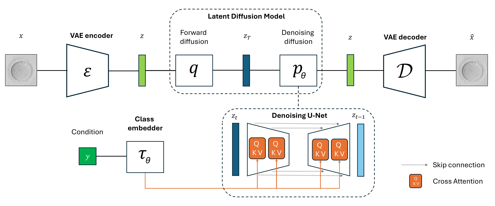

# BlastDiffusion: A Latent Diffusion Model for Generating Synthetic Embryo Images to Address Data Scarcity in In Vitro Fertilization

The official implementation of [BlastDiffusion: A Latent Diffusion Model for Generating Synthetic Embryo Images to Address Data Scarcity in In Vitro Fertilization](https://link.springer.com/chapter/10.1007/978-3-031-98688-8_15)  

[Alejandro Golfe](https://www.upv.es/ficha-personal/algolsan), [Natalia P. García-de-la-Puente](https://scholar.google.es/citations?user=](https://www.upv.es/ficha-personal/napegar), [Adrián Colomer](https://scholar.google.es/citations?user=U6BEiIEAAAAJ&hl=es&oi=ao), [Valery Naranjo](https://scholar.google.es/citations?user=jk4XsG0AAAAJ&hl=es&oi=ao)

| [Paper](https://link.springer.com/chapter/10.1007/978-3-031-98688-8_15) | [Code](https://github.com/alejandrogolfe/BlastDiffusion) |

---



## Overview

Accurately identifying oocytes that progress to the blastocyst stage is crucial in reproductive medicine. However, the limited availability of annotated high-quality embryo images poses challenges for developing automated diagnostic tools.  

To address this, we propose **BlastDiffusion**, a generative model based on **Latent Diffusion Models (LDMs)** that synthesizes realistic oocyte images conditioned on developmental outcomes. Our approach leverages a pretrained **Variational Autoencoder (VAE)** for latent space representation, combined with a diffusion process to generate images that distinguish between oocytes that reach the blastocyst stage and those that do not.  

When compared to **Blastocyst-GAN**, a GAN-based model trained for the same task, BlastDiffusion achieves superior performance, with a global **Frechet Inception Distance (FID) of 94.32**, significantly better than Blastocyst-GAN's FID of 232.73. It also improves **perceptual (LPIPS)** and **structural (SSIM)** similarity to real oocyte images. Qualitative analysis demonstrates that BlastDiffusion captures key morphological differences linked to developmental outcomes.  

These results highlight the potential of diffusion models in reproductive medicine, providing an effective tool for **data augmentation** and **automated embryo assessment**.

---

## Usage

1. Clone this repository:

```bash
git clone <repository-url>](https://github.com/alejandrogolfe/BlastDiffusion
```

2. Install dependencies

Make sure you have **Python 3.x** installed. Then, install the required Python packages:


pip install accelerate==1.0.1
pip install openpyxl
pip install wandb
pip install transformers
pip install diffusers
pip install scipy
pip install opencv-python==4.8.0.74

You can install the required dependencies by running:

```bash
pip install -r requirements.txt
```

3. File Structure

The main components of this project are:

- `sample_ddpm_class_cond.py`: Main script for evaluation.
- `train_ddpm_cond.py`: Main script for training.

4. Configuration
   
The `dataset_params` section in `config/embryo.yaml` specifies the settings for loading and processing embryo images in the BlastDiffusion pipeline. Below is a description of each parameter:

- `load_latents: False`  
  Indicates whether to load precomputed latent representations for the images. `False` means latents will be computed on-the-fly.

- `condition_types: ["context_class"]`  
  Specifies the types of conditions used for conditioning the generative model. Here, `"context_class"` indicates that the model will use the developmental outcome class of each embryo as a condition.

- `z_channels: 4`  
  Number of channels in the latent space representation used by the diffusion model.

- `lpips_path: /workspace/results/models/LPIPS/vgg.pth`  
  Path to the pretrained VGG model used for computing **LPIPS** (Learned Perceptual Image Patch Similarity) metrics during evaluation.

- `target: dataset.Embryo_loader.Embryo_loader`  
  The Python class that handles dataset loading. This points to the `Embryo_loader` class inside the `dataset/Embryo_loader.py` file.

- `directory_inception_features: /workspace/data/inception_features`  
  Directory where **Inception network features** are stored, used for FID (Frechet Inception Distance) evaluation.

- `latent_size: 64`  
  Dimensionality of the latent vector for each image.

- `params:`  
  A nested dictionary with specific arguments for the dataset loader:
  - `csv_file: /workspace/data/bbdd/final_ground_truth_MIUA/ground_truth_v2_train.csv`  
    Path to the CSV file containing image metadata and labels.
  - `root_dir: /workspace/data/images`  
    Directory where the raw embryo images are stored.
  - `im_channels: 3`  
    Number of channels in the input images (3 for RGB).


The `train_params` section in the configuration file defines the key parameters used for training the BlastDiffusion Latent Diffusion Model (LDM). Each parameter is explained below:

- `seed: 1111`  
  The random seed used to ensure reproducibility of training results.

- `task_name: '/workspace/results/output'`  
  Directory where training outputs, checkpoints, and logs will be saved.

- `ldm_batch_size: 24`  
  Batch size used for training the Latent Diffusion Model. A larger batch size may improve training stability but requires more GPU memory.

- `num_samples: 4`  
  Number of samples to generate during validation or evaluation steps.

- `ldm_validate_epochs: 4`  
  Frequency (in epochs) at which the model will be validated using the validation set. In this case, validation occurs every 4 epochs.

- `ldm_lr: 0.0005`  
  Learning rate for training the Latent Diffusion Model.

- `ldm_ckpt_name: 'best_ddpm_ckpt.pth'`  
  Name of the checkpoint file used for saving the best model during training.

- `resume_training: True`  
  Whether to resume training from an existing checkpoint if available. Setting this to `True` allows continuation of interrupted training without starting from scratch.


## Acknowledgment
This repository is mainly based on [StableDiffusion-PyTorch]([https://github.com/sthalles/SimCLR](https://github.com/explainingai-code/StableDiffusion-PyTorch)) code base. We sincerely thank prior authors on this topic for their code base.

## Citation

If you use this code in your research, please cite it appropriately.

```bibtex
@inproceedings{golfe2025blastdiffusion,
  title={BlastDiffusion: A Latent Diffusion Model for Generating Synthetic Embryo Images to Address Data Scarcity in In Vitro Fertilization},
  author={Golfe, Alejandro and Garc{\'\i}a-de-la-Puente, Natalia P and Colomer, Adri{\'a}n and Naranjo, Valery},
  booktitle={Annual Conference on Medical Image Understanding and Analysis},
  pages={205--217},
  year={2025},
  organization={Springer}
}
```


## License

This project is licensed under the MIT License - see the [LICENSE](LICENSE) file for details.
